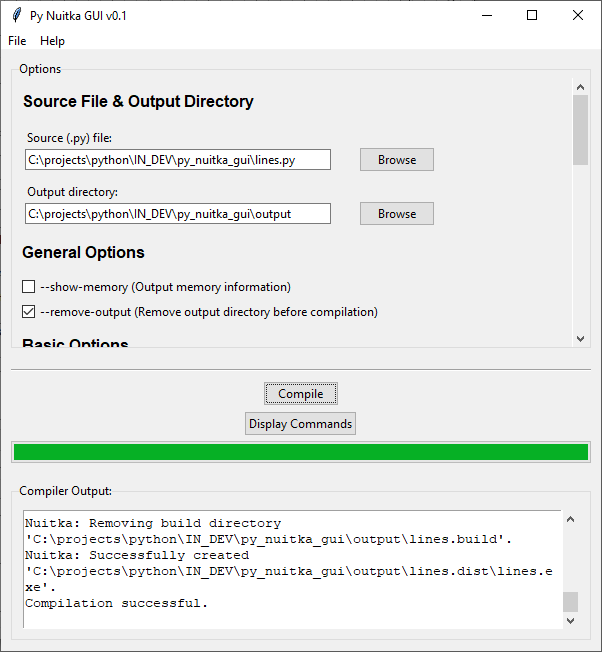

# Py Nuitka GUI

Create exe files from py files easily with Py Nuitka GUI!



Py Nuitka GUI is a graphical user interface for the Nuitka Python compiler. It provides an easy-to-use interface for compiling Python scripts using Nuitka, with various compilation options available.

## Features

- Select Python (.py) files for compilation
- Choose output directory for compiled files
- Set various compilation options
- Compilation progress display
- Save and load compilation settings
- User-friendly interface for Nuitka command-line options

## Requirements

- Python 3.6+
- Tkinter (usually comes pre-installed with Python)
- Nuitka compiler https://nuitka.net/

For a complete list of dependencies, see `requirements.txt`.

## Installation

1. Clone this repository:
   ```
   git clone https://github.com/non-npc/py-nuitka-gui.git
   ```

2. Navigate to the project directory:
   ```
   cd py-nuitka-gui
   ```

3. Install the required dependencies:
   ```
   pip install -r requirements.txt
   ```

## Usage

*Run the windows application executable* 
(Distributable coming soon, however you can generate it yourself by using this script to generate the exe.)


Run the application using Python:

```
python py_nuitka_gui.py
```

1. Select a Python file to compile using the "Browse" button.
2. Choose an output directory for the compiled files.
3. Set the desired options using the checkboxes and input fields.
4. Click "Compile" to start the compilation process.
5. The progress bar will show the compilation progress, and the output will be displayed in the "Compiler Output" section.

## Notes

Some options may have additional dependencies that must be installed by Noitka before use.
In this case, in the Compiler output you would see that Noitka is asking to install for example 'dependencywalker', when this happens click the "Display Commands" button in Py Noitka GUI and run that in your console. 
Then you will see the option to install the modules that Noitka is requesting to install. Click (Y) and once the installation is done, you should be able to use Py Noitka GUI without any issues.

## Saving and Loading Settings

- To save your current settings, go to File -> Save Settings. The default filename is 'project-settings.json'.
- To load previously saved settings, go to File -> Load Settings. The dialog will look for 'project-settings.json' by default.

## Contributing

Contributions are welcome! Please feel free to submit a Pull Request.

## License

This project is licensed under GNU license - see the [LICENSE](LICENSE) file for details.

## Acknowledgments

- [Nuitka](https://nuitka.net/) - The Python compiler used in this project
- [Tkinter](https://docs.python.org/3/library/tkinter.html) - The standard GUI library for Python